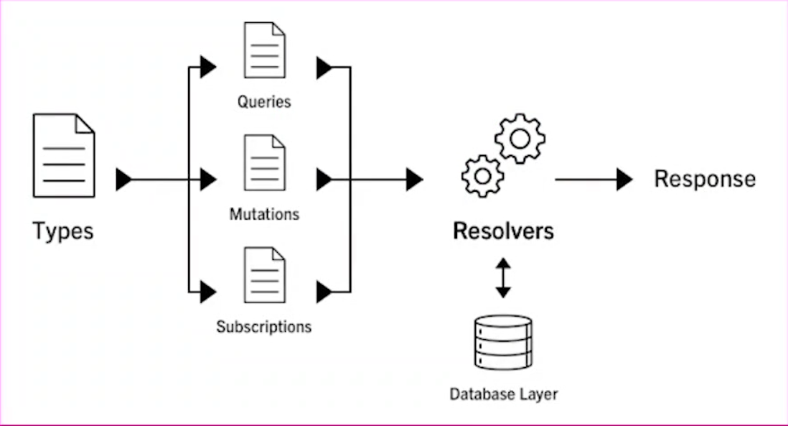

# Graphql desde cero

## Conceptos basicos

### ¿Qué es Graphql?

Es un lenguaje de comunicación basado en consultas que permiten comunicar dos partes de una manera predecible. Esto quiere decir que va a existir un cliente que va a solicitar información a un servidor y este va a ser capaz de regresar la información que el cliente solicito de manera precisa. Se dice que es predecible ya que el cliente solo obtiene la información que solicita en su aplicación.

Es un nuevo estandar para API creado por facebook. Ademas es un lenguaje basado en tipos y auto-documentado.

### ¿Cómo funciona Graphql?

Se tiene un cliente al lado izquierdo el cual va a enviar una petición a una capa de graphql que va a ser capaz de comunicarse a diferentes fuentes de datos tales como: Bases de datos SQL y noSQL, rest API o incluso otras API de tipo graphql. Una vez que obtenga la información graphql va a ser capaz de moldear la información para así poder delverla como el cliente la necesita en formato JSON.

### ¿Cómo se compone graphql?

Graphql se compone de dos elementos en particular:

- Schema: Queries, mutations y subscriptions.

- Resolvers: Son las funciones que se ejecutan siempre que se llama a un schema y son los encargados de obtener la información que necesita ese schema. Ellos son los que se van a conectar a las diferentes capas de datos.

### Diferencias entre Rest y Graphql

Rest:

- El servidor solo expone los recursos. El cliente no puede modificar lo que quiere pedir, solo puede realizar la consulta y depender lo que la API le envie. El cliente se debe adecuar a lo que la API le envie.

- Overfetching: Es la sobre carga de peticiones. Es cuando no se obtiene toda la información y es necesario volver a realizar una nueva petición hasta obtener toda la información que se necesita.

- El tamaño del payload es definido por el servidor. El servidor define que información se le va a devolver al cliente, este ultimo no puede depurar dicha información y va a depender de lo que el servidor le mande.

- Documentacion al finalizar el desarrollo.

Graphql:

- Expone un contrato de comunicación que se conoce como schema. El schema le va a indicar al cliente lo que puede hacer durante una petición.

- El cliente solicita lo que necesita: El cliente va a poder enviar una request en la que va a poder pedir la información que solo necesita en ese momento.

- Tiempo de respuesta más rápidos: Esto es debido a que el payload es mas ligero.

- Payloads configurados por el cliente.

- Podemos tener toda la información en una sola request, es decir que podemos adaptar la información a como la necesita el cliente.

### Herramientas a utlizar

- [graphql-yoga](https://github.com/dotansimha/graphql-yoga)
- [prisma](https://www.prisma.io/)
- [postgres](https://www.postgresql.org/)
- [docker](https://www.docker.com/)
- [gitignore.io](https://www.toptal.com/developers/gitignore)
- [hub](https://github.com/github/hub)

## Schemas y queries

## Mutations

## Subscriptions

## Agregando Prisma

## Authentications

## Pagination and sorting

## Deplpoyment
